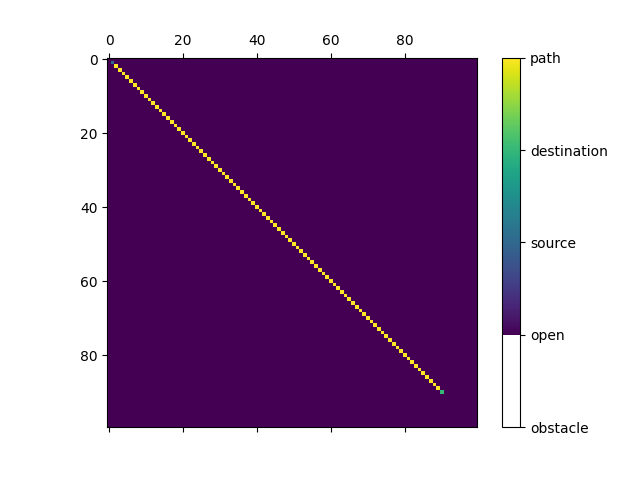

# Description
This project is an implementation of the A* search algorithm which is very popular as a path finding algorithm. the project includes two implementations. One done in C++, the other in python.
the visualizations seen below are done using matplotlib on the python implementation

These two implementations are kept as similiar as possible in order to perform some benchmarking between the two langauage implemenations. Algorithm was adopted from this [article](https://www.geeksforgeeks.org/a-search-algorithm/)

# Implementation specifics
A* requires the input of a map (Binary occupancy map) denoting the areas of the map which are
designated as obstacles, which the algorithm cannot explore, and areas which are free to explore. it also requires the input of two points on the map and it can then proceed to search for the shortest path between these two points.

For simplicity, instead of reading a map from disk, the programs prompts the user for the size of a map(in the python version only, the c++ version assumes the size of the map) which is assumed to be all open and the user is then prompted for obstacle locations on the map.
the user is also prompted for the location of the source and destination nodes. All inputs are parsed for errors and the program proceeds accordingly.

The cost of the nodes is taken as the euclidean distance. Moreover, these distances are all multiplied by a factor of 10 to give round, more readable numbers.

  

In the C++ implementation, the open and closed lists and declared as vectors but would more effectively searched if they were deques. However, this was not possible with this implementation as the comparison operators and equality operators are overloaded for different purposes, which clashes with the implementation of the deque container and by extension how it is searched by the STL APIs.

This implementation of the algorithm preserves memory by only creating objects for the nodes desired for exploration. Concretely, at initialization only the source node is instantiated. as the algorithm proceeds, each node object instantiates nodes for its eight neighbors, and so on until a path is found to the destination node.

# Usage
* The program prompts the user to input two values for the obstacle locations, map size.. etc
* The input must be two integer values seperated by a space
* If no obstacles are provied by the user, the entire map is assumed to be open
* The output in the terminal denotes the coordinates of the nodes in sequential order from the desitnation to the source node

# Results
Here are some visualizations for the algorithm working with different maps with varying sizes.

  

  

  

